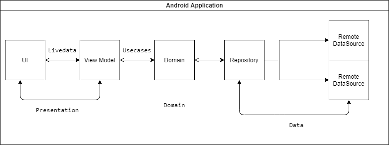

# tn-secure-mvvm-clean-architech

An Android app consuming a News API to display Hot News it has been built with clean architecture principles, Repository Pattern and MVVM pattern as well as Architecture Components.
## Table of Contents

- [Architecture](#Architecture)
- [Security Pattern](#SecurityPattern)
- [How the encryption and signing work](#WorkFlow)

# Architecture
The Application is split into a three layer architecture:
- Presentation
- Domain
- Data
  


This provides better abstractions between framework implementations
and the underlying business logic.It requires a number of classes to get
things running but the pros outweigh the cons in terms of building an app
that should scale.

The 3 layered architectural approach is majorly guided by clean architecture which provides
a clear separation of concerns with its Abstraction Principle.

#### Presentation

```app``` contains the UI files and handles binding of DI components from other modules.
Binding of data is facilitated by jetpacks data binding by serving data from the viewmodel
to the UI.The data being received is part of a viewstate class that has properties contained in the
relevant state.

#### Domain

The ```domain``` module contains domain model classes which represent the
data we will be handling across presentation and data layer.

Use cases are also provided in the domain layer and orchestrate the flow
of data from the data layer onto the presentation layer and a split into
modular pieces serving one particular purpose.

The UseCases use a ```BaseUseCase``` interface that defines the parameters its taking in and
output this helps in creating fakes using in testing.

#### Data

- ```data-remote```

Handles data interacting with the network and is later serverd up to the presentation layer through
domain object

- ```data-local```

Handles persistence of object with Room ORM from.This module is responsible for handling all local related
logic and serves up data to and from the presentation layer through domain objects.

With this separation we can easily swap in new or replace the database being used without causeing
major ripples across the codebase.

# SecurityPattern
This application also demo some part of security when Retrofit communicate with backend
- SSL Pinning: to avoid Middle man tool like: Fiddler, Proxy Man 
- Encryption and signing:
The mainly principle of this is combination of RSA and AES algorithm.
  Server has the keypair: PrivateKey + PublicKey(share to client side)
  CLient has the keypair: PrivateKey  + PublicKey(share to backend side)
  
Using these key set can archive the secure transaction data, for more detail please check below session.
# WorkFlow
 As above session i mentioned to use keypair,but the problem is saving PrivateKey in mobile storage is a very bad practices.
#### Protect private key in local application
In the real world, saving plain Private in mobile storage is a bad practice. 
So i decided to save encrypted PrivateKey(AES algorithm) and embedded it into res/raw folder.
But if how to protect encryption key? Yes i found this plugin 
https://github.com/klaxit/hidden-secrets-gradle-plugin/blob/master/README.md.
The idea here is use NDK and some SHIFT algorithm and save the SecretKey, and this plugin can help to archive the same with Dexguard,
so that we can avoid reverse engineer.

### Flow to work

Request

| URL | POST|
 | --- | --- |
| Content-Type | application/json |
| Parameters | oneSecSlot(currentTime):Used to prevent request replay attack  |
| Parameters | cNonce: use for verify signature  |
| Parameters | sessionKey: encrypted [secureRandom] key  |
| Parameters | requestData: encrypted user data use [secureRandom]  |
| Parameters | signature: signature to verify  |

Respond

| URL | POST |
  | --- | --- |
| Content-Type | application/json |
| Parameters | data:encrypted respond data |
| Parameters | code: respond code  |
| Parameters | message: respond message  |
| Parameters | signature: signature to verify  |

How it works:
- Client<br>
  <t>+ `secretKey`: Get from Secret Native C<br>
  <t>+ `serverPublicKey`: Share by server<br>
  <t>+ `clientPrivateKey`: This key store in bin.dat and totally encrypted with a secret key(I will explain more in the Face to face interview).
- Server<br>
  <t>+ `clientPublicKey`: Share by client<br>
  <t>+ `serverPrivateKey`: PrivateKey store in server storage

- Working flow:<br>
  <t> + Client `sessionAESPlainKey = secureRandom(32)` <br>
  <t> + Client `sessionKey = RSA.encrypt(sessionAESKey,serverPublicKey)`<br>
  <t> + Client `requestData = AES.encrypt(jsonData,sessionAESPlainKey)`<br>
  <t> + Client `cNonce = randomByte(16)`<br>
  <t> + Client `oneSecSlot = oneSecSlot(oneSecSlot)`<br>
  <t> + Client `signature = RSA.sign([sessionKey + onesecslot + requestData + nonce],clientPrivateKey)`<br>
  <br>
  <t> + Server verify `signature` by client `clientPublicKey`<br>
  <t>+ Server decrypted `sessionKey` by server `serverPrivateKey`<br>
  <t>+ Server use decrypted `sessionKey` to decrypted `requestData`<br>
  <t>+ Server encrypted `data=AES.encryp(respondData,sessionKey)` <br>
  <t> + Server `signature = RSA.sign([code + data + cNonce],serverPrivateKey)`<br>
  <br>
  <t>+ Client receive respond <br>
  <t>+ Client verify signature by `serverPrivateKey` <br>
  <t> + Client process respond data<br>